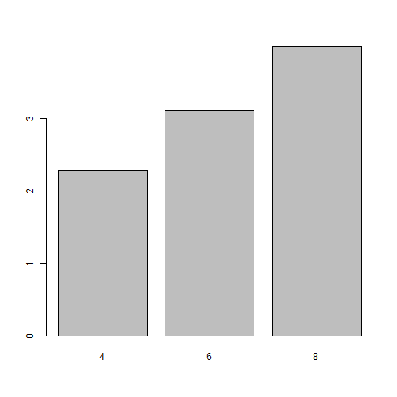

<style>
em {
  font-style: italic
}
strong {
  font-weight: bold;
}
</style>

## Basic fuctions

+ `apply()`: Family of looping functions
+ `length()`: Return the number of elements in vector x.
+ `paste()` or `paste0()`: Concatenate vectors after converting to character.
+ `rep(1,5)`: Repeat the number 1 five times
+ `seq(1,10,0.4)`: Generate a sequence (1 -> 10, spaced by 0.4)
+ `sort()`: Sort the vector x
+ `order()`: List sorted element numbers of x
+ `summary()`: Returns a summary of a given object (e.g., data frame, lm, etc.).
+ `table()`: Returns a contigency table for each combination of factors.
+ `tolower()`, `toupper()`: Convert string to lower/upper case letters.
+ `unique()`: Remove duplicate entries from vector

--- .class #id 

## Basic fuctions

+ **`apply()`: Family of looping functions**
+ `length()`: Return the number of elements in vector x.
+ `paste()` or `paste0()`: Concatenate vectors after converting to character.
+ `rep(1,5)`: Repeat the number 1 five times
+ `seq(1,10,0.4)`: Generate a sequence (1 -> 10, spaced by 0.4)
+ `sort()`: Sort the vector x
+ `order()`: List sorted element numbers of x
+ `summary()`**: Returns a summary of a given object (e.g., data frame, lm, etc.).**
+ `table()`**: Returns a contigency table for each combination of factors.**
+ `tolower()`, `toupper()`: Convert string to lower/upper case letters.
+ `unique()`: Remove duplicate entries from vector.

---

## `table()`

The `table()` uses the cross-classifiying factors to build a contigency table of the count at each combination of factor levels.

---

## `table()`

The `table()` uses the cross-classifiying factors to build a contigency table of the count at each combination of factor levels.


```r
> table(mtcars$cyl)
## 
##  4  6  8 
## 11  7 14
```


```r
> table(mtcars$cyl,mtcars$am)
##    
##      0  1
##   4  3  8
##   6  4  3
##   8 12  2
```

--- .segue .dark .nobackground

## apply family functions

---

## `apply` family functions

+ Using looping control structure as `for` and `while` are not that much efficient by themselfs. However, pre-allocating memory improves their performace.

+ `apply` functions use efficiently the resources by doing pre-allocation automatically.

+ Using `apply` functions make easy to parallelize your code.

---

## `apply` family functions

+ `lapply()`: To loop over a list and evaluate on each element.
+ `sapply()`: the same as `lapply`, but with the output in a more simpler form.
+ `apply`: To apply functions over array margins.
+ `tapply`: To apply a function to each cell of a ranged array. 


---

## `lapply()` function


```r
> args(lapply)
## function (X, FUN, ...) 
## NULL
```

`lapply` takes three arguments: 
  + `X` a list
  + `FUN` a function
  + `...` additional arguments of the function `FUN`

If `X` is not a list, it will be coerced to a list using `as.list()` function.

`lapply` returns a list.

---

## `lapply()` example


```r
> lapply(mtcars,mean) #Returns the mean for each variable in a list
## $mpg
## [1] 20.1
## 
## $cyl
## [1] 6.19
## 
## $disp
## [1] 231
## 
## $hp
## [1] 147
## 
## $drat
## [1] 3.6
## 
## $wt
## [1] 3.22
## 
## $qsec
## [1] 17.8
## 
## $vs
## [1] 0.438
## 
## $am
## [1] 0.406
## 
## $gear
## [1] 3.69
## 
## $carb
## [1] 2.81
```

---

## `sapply()` function


```r
> args(sapply)
## function (X, FUN, ..., simplify = TRUE, USE.NAMES = TRUE) 
## NULL
```

`sapply` takes various arguments: 
  + `X` a list
  + `FUN` a function
  + `...` additional arguments of the function `FUN`
  + `simplify` a logical value. If `TRUE`, should return a simplified version of `lapply` function results. (e.g, vector, matrix or array) 

If `X` is not a list, it will be coerced to a list using `as.list()` function.

---

## `sapply()` example


```r
> sapply(mtcars,mean) #Returns the mean for each variable in a vector
##     mpg     cyl    disp      hp    drat      wt    qsec      vs      am    gear 
##  20.091   6.188 230.722 146.688   3.597   3.217  17.849   0.438   0.406   3.688 
##    carb 
##   2.812
```

---

## Exercise 

1. What is the maximum value in each of the variables in `mtcars` data set?

---
## `apply()` function


```r
> args(apply)
## function (X, MARGIN, FUN, ...) 
## NULL
```

`apply` takes four arguments: 
  + `X` an array, including matrix
  + `MARGIN` a vector giving the subscripts which the function will be applied over. e.g., for a matrix 1 indicates rows, 2 indicates columns, c(1, 2) indicates rows and columns. 
  + `FUN` a function
  + `...` additional arguments of the function `FUN`

It is most often used to apply a function to the rows or columns of a matrix.

---

## `apply()` example


```r
> x <- cbind(x1 = 3, x2 = c(4:1, 2:5))
> x
##      x1 x2
## [1,]  3  4
## [2,]  3  3
## [3,]  3  2
## [4,]  3  1
## [5,]  3  2
## [6,]  3  3
## [7,]  3  4
## [8,]  3  5
```

---

## `apply()` example


```r
> #col sums
> apply(x, 2, sum) 
## x1 x2 
## 24 24
```


```r
> #row sums
> apply(x, 1, sum) 
## [1] 7 6 5 4 5 6 7 8
```

---

## `tapply()` function


```r
> args(tapply)
## function (X, INDEX, FUN = NULL, ..., simplify = TRUE) 
## NULL
```

`apply` takes four arguments: 
  + `X` a vector (typically)
  + `INDEX` list of one or more factors, each of same length as `X`. The elements are coerced to factors by `as.factor()`
  + `FUN` a function
  + `...` additional arguments of the function `FUN`

Useful to summarise information across groups

---

## `tapply` example


```r
> tapply(mtcars$wt, mtcars$cyl, mean)
##    4    6    8 
## 2.29 3.12 4.00
```


```r
> tapply(mtcars$wt, mtcars$cyl, sd)
##     4     6     8 
## 0.570 0.356 0.759
```

---
## `tapply` example


```r
> weightbycyl <- tapply(mtcars$wt, mtcars$cyl, mean)
> barplot(weightbycyl)
```



---

## `tapply` example 2


```r
> #tapply with multiple factors
> tapply(mtcars$wt, list(mtcars$cyl,mtcars$carb), mean)
##      1    2    3    4    6    8
## 4 2.15 2.40   NA   NA   NA   NA
## 6 3.34   NA   NA 3.09 2.77   NA
## 8   NA 3.56 3.86 4.43   NA 3.57
```

---

## Exercise 

1. Are, in average, cars with automatic transmission (`?mtcars`) heavier that those with manual transmission?
2. Compare `tapply()` and `table()` functions. How are they similar? How are they different?


--- .segue .dark .nobackground

## summary function

---

## `summary()`

`summary` is a generic function used to produce result summaries of the results of various model fitting functions.


```r
> data(mtcars) #Load mtcars data to environment
> summary(mtcars)
##       mpg            cyl            disp           hp           drat     
##  Min.   :10.4   Min.   :4.00   Min.   : 71   Min.   : 52   Min.   :2.76  
##  1st Qu.:15.4   1st Qu.:4.00   1st Qu.:121   1st Qu.: 96   1st Qu.:3.08  
##  Median :19.2   Median :6.00   Median :196   Median :123   Median :3.69  
##  Mean   :20.1   Mean   :6.19   Mean   :231   Mean   :147   Mean   :3.60  
##  3rd Qu.:22.8   3rd Qu.:8.00   3rd Qu.:326   3rd Qu.:180   3rd Qu.:3.92  
##  Max.   :33.9   Max.   :8.00   Max.   :472   Max.   :335   Max.   :4.93  
##        wt            qsec            vs              am             gear     
##  Min.   :1.51   Min.   :14.5   Min.   :0.000   Min.   :0.000   Min.   :3.00  
##  1st Qu.:2.58   1st Qu.:16.9   1st Qu.:0.000   1st Qu.:0.000   1st Qu.:3.00  
##  Median :3.33   Median :17.7   Median :0.000   Median :0.000   Median :4.00  
##  Mean   :3.22   Mean   :17.9   Mean   :0.438   Mean   :0.406   Mean   :3.69  
##  3rd Qu.:3.61   3rd Qu.:18.9   3rd Qu.:1.000   3rd Qu.:1.000   3rd Qu.:4.00  
##  Max.   :5.42   Max.   :22.9   Max.   :1.000   Max.   :1.000   Max.   :5.00  
##       carb     
##  Min.   :1.00  
##  1st Qu.:2.00  
##  Median :2.00  
##  Mean   :2.81  
##  3rd Qu.:4.00  
##  Max.   :8.00
```

---

## Exercises

1. Design a function that receive as argument a numeric vector and returns the descriptive statistics of the vector in a data frame. (`mean`, `sd`, `median`, `minimum`, and `maximum`)
2. Report the descriptive statistics for all the variables in `mtcars` using only one code line.
3. Report the descriptive statistics for the weigth variable (`wt`) group by the transmission type.(`?mtcars`). Use only one code line.

---

## Homework

**PENDING**

---
## References

+ Koduvely, D. H. M. (2015). *Learning Bayesian Models with R*. Packt Publishing Limited.
+ Ross, N. (2013). *FasteR! HigheR! StrongeR! - A Guide to Speeding Up R Code for Busy People*. http://www.noamross.net/blog/2013/4/25/faster-talk.html
