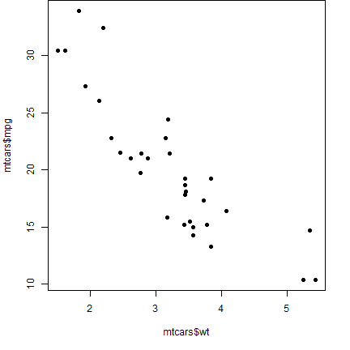
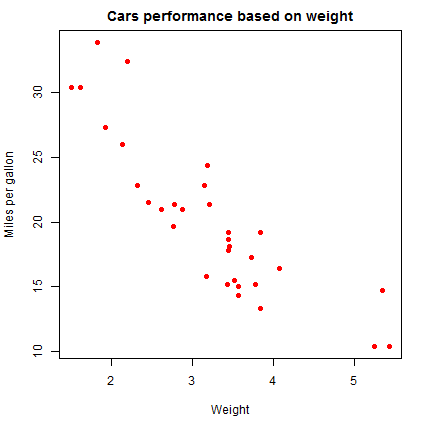
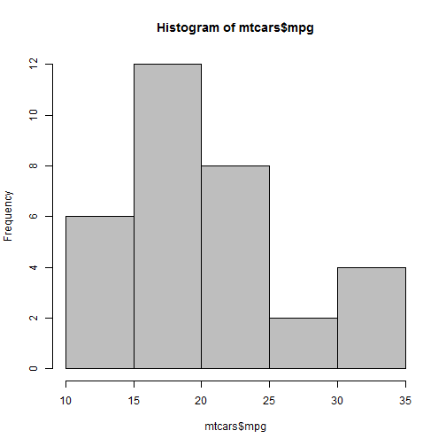
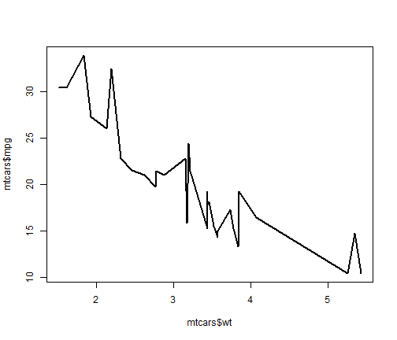
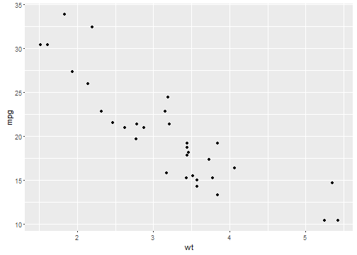
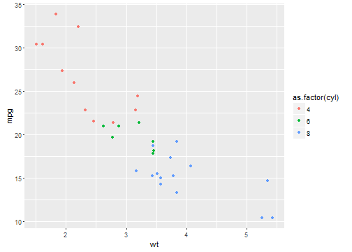

<style>
em {
  font-style: italic
}
strong {
  font-weight: bold;
}
</style>


## Plotting

R Provides a set of fuctions and packages for visualizing data. The following packages are the most commonly used for plotting (they can not be mixed).

  + **graphics**: contains the basic plotting functions from the "base" graphic system (e.g. `plot`, `hist`, `boxplot`).
  + **lattice**: aims to improve on base R graphics by providing better defaults and the ability to easily display multivariate relationships (e.g. `xyplot`, `bwplot`, `levelplot`)
  + **ggplot2**: offers a powerful graphics language for creating elegant and complex plots.  Originally based on Leland Wilkinson's The Grammar of Graphics book (e.g. `qplot`, `ggplot`).

--- .class #id .segue .dark .nobackground

## graphics package

---

## Base graphics

+ Base graphics are used most commonly and are a very powerful system for creating 2-D graphics.


```r
> data(mtcars)
> plot(x =  mtcars$wt, y = mtcars$mpg)
```

<center>

</center>

---

## Function parameters (`par`)

The `par()` function is used to specify global parameters that affect all plots in an R session (see `?par`).

This parameters can often be overrriden as arguments to specific plotting functions.

  + `pch`: the plotting symbol (default is open circle)
  + `lty`: the line type (default is solid line), can be dashed, dotted, etc.
  + `lwd`: the line width, specified as an integer multiple
  + `col`: the plotting color, specified as a number, string, or hex code; the colors function gives you a vector of colors by name.
  + `las`: the orientation of the axis labels on the plot.

--- &twocol

## Params - `pch`

*** {name: left}

<center>

</center>

*** {name: right}
 


```r
> plot(x =  mtcars$wt, 
+      y = mtcars$mpg, 
+      pch = 19)
```

--- &twocol

## Params - `main`, `xlim` & `ylim`

*** {name: left}

<center>

</center>

*** {name: right}


```r
> plot(x =  mtcars$wt, y = mtcars$mpg, 
+      pch = 19, col = 2, 
+      main = "Cars performance
+       based on weight",
+      xlab = "Weight", 
+      ylab = "Miles per gallon")
```


--- &twocol

## Add layer - grid

*** {name: left}

<center>

</center>

*** {name: right}


```r
> plot(x =  mtcars$wt, y = mtcars$mpg, 
+      pch = 19, col = 2, 
+      main = "Cars performance
+       based on weight",
+      xlab = "Weight", 
+      ylab = "Miles per gallon")
> grid(lwd = 2)
```


--- &twocol

## Add more data - abline

*** {name: left}

<center>

</center>

*** {name: right}


```r
> plot(x =  mtcars$wt, y = mtcars$mpg, 
+      pch = 19, col = 2, 
+      main = "Cars performance
+       based on weight",
+      xlab = "Weight", 
+      ylab = "Miles per gallon")
> grid(lwd = 2)
> lm1 <- lm(mpg ~ wt, data = mtcars)
> abline(lm1, col = "blue", lwd = 2)
```

---

## More on base graphics

+ More useful params are: 
  + `xlim`
  + `ylim`
  + `type`
  + `cex`
+ Functions to add information:
  + `points`
  + `abline`
+ Other plots:
  + `hist`
  + `barplot`

---

## Basic graphs - hist


```r
> hist(mtcars$mpg, col ="gray")
```




---

## Basic graphs - barplot


```r
> counts <- table(mtcars$cyl)
> barplot(counts)
```


---

## Basic graphs - barplot


```r
> counts <- table(mtcars$am,mtcars$cyl)
> barplot(counts, col = c("blue", "red"))
```


---

## Basic graphs - line plot


```r
> mtcars <- arrange(mtcars,wt)
> plot(mtcars$wt, mtcars$mpg, type = "l", lwd = 2) 
```

<center>

</center>

--- .class #id .segue .dark .nobackground

## ggplot2 package

---

## ggplot2

This package was developed by Hadley Wickham and provides a lenguage to create beautiful plots quick and easy.


```r
> library(ggplot2)
> qplot(data = mtcars, x =  wt, y = mpg)
```

<center>

</center>

---

## Basic plots - scatterplot


```r
> qplot(data=mtcars,wt,mpg)
```

<center>

</center>

---

## Basic plots - scatterplot


```r
> qplot(data=mtcars, wt, mpg,
+       color = as.factor(cyl),shape = as.factor(am))
```

<center>

</center>

---

## Basic plots - scatterplot


```r
> qplot(data=mtcars, wt, mpg,
+       color = as.factor(cyl),shape = as.factor(am))
```

<center>

</center>

---

## Basic plots - scatterplot


```r
> qplot(data=mtcars, wt, mpg,
+       color = as.factor(cyl),shape = as.factor(am),
+       size = hp)
```

<center>

</center>

---

## Basic plots - histograms


```r
> qplot(data=mtcars,mpg)
```

<center>

</center>


---

## Basic plots - histograms


```r
> qplot(factor(cyl), data=mtcars, geom="bar", fill=factor(am))
```

<center>

</center>


---

## Basic plot - lineplot


```r
> qplot(mtcars$wt, mtcars$mpg, geom = "line") 
```

<center>

</center>


---

## Exercises

For this excercise use download .agd file of the accelerometry data oof one participant. Use the following code to read the .agd data.


```r
> library(RSQLite)
> library(dyplr)
> con <- dbConnect(RSQLite::SQLite(), 
+                  dbname="C:/Users/Manuel/Dropbox/1. Mis documentos/1. Medicina/R course/data/A1_0011_01.agd")
> df <- dbGetQuery(conn=con, 
+                  statement=
+                    paste("SELECT (cast(dataTimestamp as double))*1.0e-7 as datetime, *
+                          FROM '","data", "'", sep="")) %>%
+   select(-dataTimestamp) %>% 
+   mutate(datetime = datetime-62135596800,
+          datetime = decimal_date(datetime,origin="1970-01-01 00:00:00", "GMT"))
> dbDisconnect(con)
```

---

## Exercises

1. Plot in a line chart the physical activity (PA) (axis 1) of the participant against time for all days. 

2. Plot the physical activity (PA) (axis 1) of the participant against time for one day between 6:00 am and 09:00 pm. Hint: use `as.Date()` and `hour()` function - `lubridate` package


```r
> # Moving average function
> mav <- function(datetime,values,n=1){
+   val <- rep(-1,length(values))
+   for(i in seq_along(datetime)){
+     if(i<=n){
+       val[i] <- NA
+     }
+     else{
+     val[i] <- mean(values[(i-n):(i+n)])
+     }
+   }
+   return(data.frame(datetime,val))
+ }
```


---

## Exercises

3. Plot the average PA activity per hour. What is the more active hour in the day?

4. Compare the PA of two participants. Who is more active?


